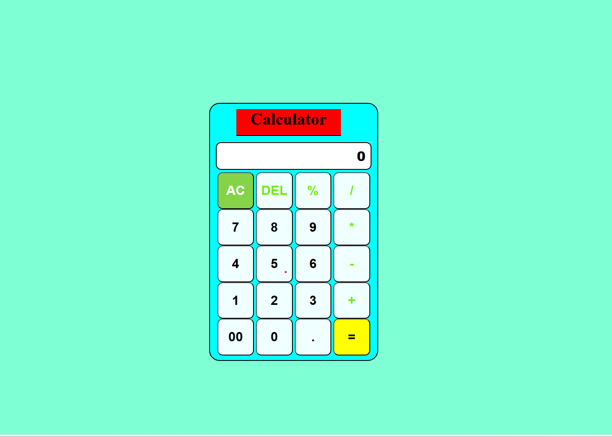

# CALCUTATOR-HTML_CSS_JS

## Calculator Description

### This calculator is a basic web-based tool that allows users to perform simple arithmetic operations such as addition, subtraction, multiplication, and division. It features:

  #### - A clean and responsive user interface
  #### - Buttons for digits (0–9), operations (+, −, ×, ÷, %) and control (AC,DEL, =)
  #### - Real-time display of input and results
  #### - JavaScript logic to handle calculations and input validation

# Output:-

